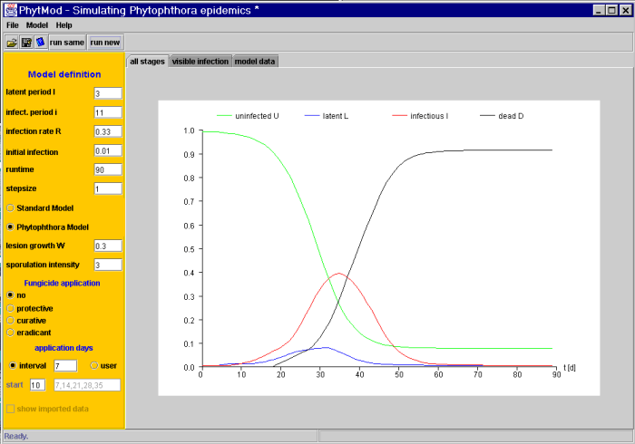

# PhytMod

PhytMod is a Java desktop application for simulating plant disease epidemics, especially potato late blight caused by *Phytophthora infestans*.

It was written in 2001–2002 by Heiko Apel at the Institute of Geoecology, TU Braunschweig, Germany. This repository archives the original source code. Apart from a change of character encoding to UTF-8, the code has not been modified.   

The Java code is associated to this publication:   
```
Apel, H., Paudyal, M.S., and Richter, O. (2003). Evaluation of treatment strategies of the late blight Phytophthora infestans in Nepal by population dynamics modelling. Environmental Modelling and Software 18(4), 355-364. doi: https://doi.org/10.1016/S1364-8152(02)00106-8.
```   



## Models

PhytMod solves a delay differential equation model with four state variables: **uninfected**, **latent**, **infectious** and **dead** (removed) host tissue. The available model variants are:

- **Standard model**: the classic epidemic model with a latent period and an infectious period, in the style of Vanderplank.
- **Phytophthora model**: extends the standard model with a sporulation function and lesion growth (`W`).
- **Fungicide treatments**: Phytophthora model runs with protective, curative or eradicative fungicide applications. Applications can be scheduled at fixed intervals or on user-defined days.

The results are shown in a table and as plots. Plots can be compared with measured field data that you import.

## Source code structure

All code is in the package `lateblight` under [`src/lateblight/`](src/lateblight/):

| File | Purpose |
|---|---|
| `Phyt_model.java` | Entry point (`main`). Creates and shows the main window. |
| `Phyt_Frame.java` | Main window: input fields, menus, results table, opening and saving files, import and export. `RunModel()` reads the inputs and calls the kernel. |
| `PhytKernel.java` | The numerical model. The `execute*Kernel*()` methods integrate the equations with time step `dt`. |
| `GraphPane.java` | Draws the result curves and the measured data. |
| `ParamEstimation.java` | Experimental parameter fitting (Levenberg–Marquardt). Not connected to the user interface. |
| `HelpFrame.java`, `Phyt_Frame_AboutBox.java` | Help window and About dialog. |
| `GraphDraw.java`, `GraphicsPanel.java` | Older plotting code. |
| `ExampleFileFilter.java` | File filter for the file dialogs (Sun sample code). |
| `docs/` | HTML help shown inside the application. |

The GUI was originally built with Borland JBuilder 5 and JDK 1.3. The many small `Phyt_Frame_*_actionAdapter` classes are JBuilder-generated event handlers.

## Running

A ready-to-run `PhytMod.jar` (version 1.1, 2002) is included in this repository. It needs Java 8 or newer:

```
java -jar PhytMod.jar
```

## Building

To build `PhytMod.jar` yourself, you need a JDK (Java 8 or newer; tested with JDK 25). On Windows:

```
build.bat
java -jar PhytMod.jar
```

On other systems:

```sh
mkdir -p build
javac --release 8 -nowarn -encoding UTF-8 -cp lib/optimization.jar -d build src/lateblight/*.java
cp src/lateblight/*.gif build/lateblight/ && cp -r src/lateblight/docs build/lateblight/
(cd build && jar xf ../lib/optimization.jar && rm -rf META-INF)
jar cfe PhytMod.jar lateblight.Phyt_model -C build .
java -jar PhytMod.jar
```

## Example files

[`examples/`](examples/) contains two saved model setups (`.pmf`). Load them with **File → Open**. The format is plain text with one parameter per line: latent period, infectious period, R, initial infection, tmax, dt, W, sporulation intensity, application interval, application start, application days, and the model and fungicide selections.

## Third-party code

`lib/optimization.jar` contains the compiled classes of the Java translation of MINPACK, UNCMIN, FMIN and FZERO by Steve Verrill (USDA Forest Products Laboratory). That library is in the public domain. Its source code is not included here.

## License

The PhytMod source code is released under [CC0 1.0 Universal](LICENSE) (public domain dedication).
